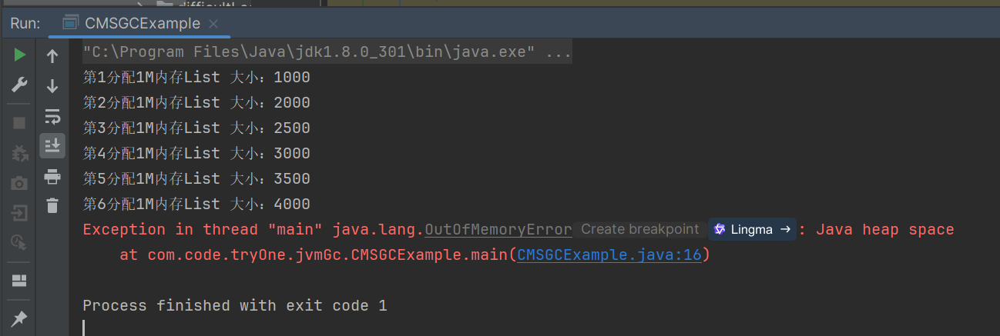
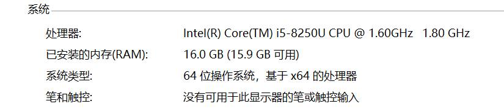
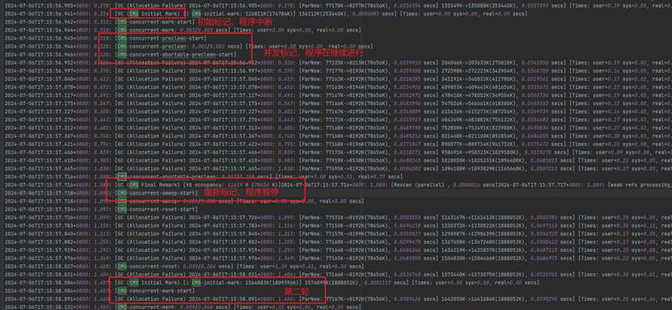
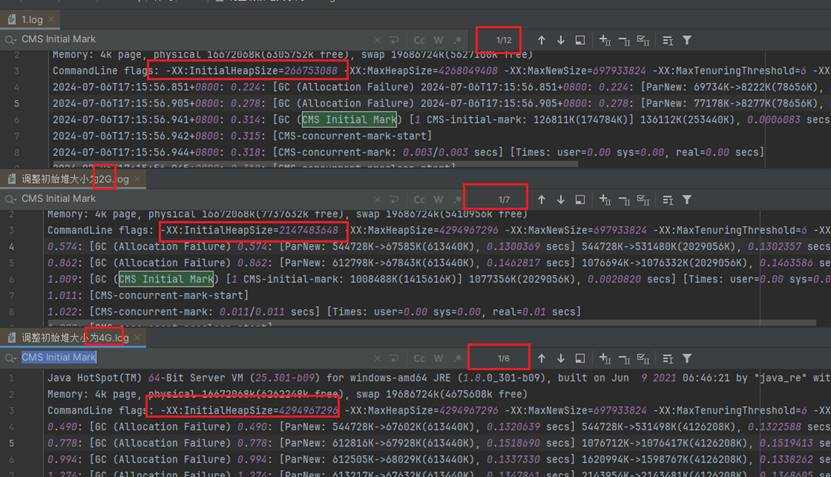
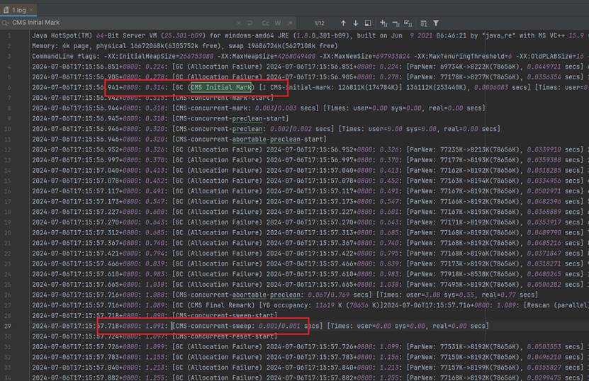
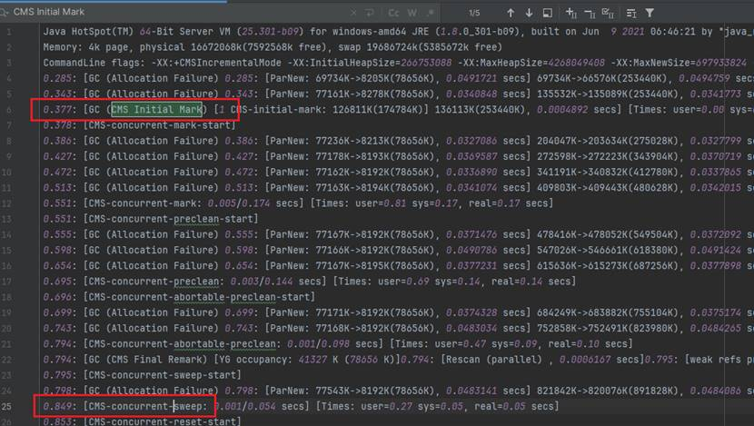
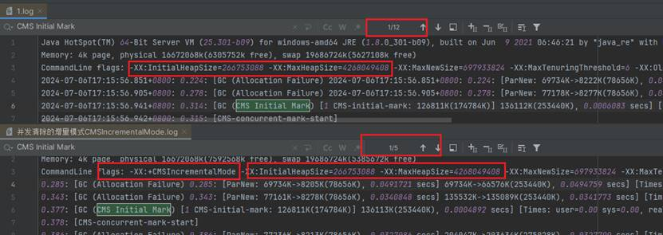

# 1、java程序

```java
public class CMSGCExample {
    public static void main(String[] args) {
        List<byte[]> memoryHog = new ArrayList<>();
        int k = 1;
        while (true) {
            for (int i = 0; i < 1000; i++) {
                // 分配1MB的数组
                byte[] array = new byte[1024 * 1024];
                memoryHog.add(array);
            }
            System.out.println("第" + k++ + "分配1M内存" + "List 大小：" + memoryHog.size());
            // 模拟内存使用情况
            if (memoryHog.size() > 1000) {
                memoryHog.subList(0, 500).clear();
            }

            try {
                // 暂停一段时间，模拟应用程序的其他工作
                Thread.sleep(100);
            } catch (InterruptedException e) {
                e.printStackTrace();
            }
        }
    }
}
```

# 2、java命令

```
  -XX:+UseConcMarkSweepGC   
  -XX:+PrintGCDetails   
  -XX:+PrintGCDateStamps   
  -Xloggc:./gc.log  
```

命令解释：

-XX:+UseConcMarkSweepGC：启用并发标记清除（CMS）垃圾收集器。

-XX:+PrintGCDetails：在垃圾收集时打印详细的GC日志信息。包括每次GC的类型、时间、回收的内存量等详细信息。

-XX:+PrintGCDateStamps：在GC日志中添加真实的时间戳

-Xloggc:./gc.log：指定GC日志的输出文件路径。

# 3、运行结果



# 4、GC日志部分分析

## 1、现在机器上的配置



```
Memory: 4k page, physical 16672068k(6305752k free), swap 19686724k(5627108k free)
```

指的是系统页面大小为4KB。"physical 16672068k"表示物理内存总量约为16GB，其中有"6305752k free"约为6GB的空闲内存。"swap
19686724k"表示交换空间总量约为19GB，其中有"5627108k free"约为5GB的空闲交换空间。

## 2、该程序运行的参数

-XX:InitialHeapSize=266753088 // 设置JVM启动时堆的初始大小为约266MB。 -XX:MaxHeapSize=4268049408 // 设置JVM堆的最大大小为约4GB。
-XX:MaxNewSize=697933824 // 设置年轻代的最大大小为约697MB。 -XX:MaxTenuringThreshold=6 // 设置对象在年轻代中的最大存活次数为6次，之后会被移动到老年代。
-XX:OldPLABSize=16 // 设置老年代中PLAB(私有分配缓冲区)的大小。 -XX:+PrintGC //启用打印GC信息。 -XX:+PrintGCDateStamps //
启用打印GC的日期戳。 -XX:+PrintGCDetails // 启用打印GC的详细信息。 -XX:+PrintGCTimeStamps // 启用打印GC的时间戳。 -XX:
+UseCompressedClassPointers // 启用压缩类指针，减少内存使用，默认打开 -XX:+UseCompressedOops // 启用压缩普通对象指针，减少内存使用，默认打开。
-XX:+UseConcMarkSweepGC // 使用并发标记清除(CMS)垃圾收集器。 -XX:-UseLargePagesIndividualAllocation // 禁用大页的单独分配。
-XX:+UseParNewGC // 使用ParNew垃圾收集器，它是一个并行的年轻代收集器。

CMS（并发标记清除）垃圾收集器主要用于老年代，而ParNew垃圾收集器则是专门为年轻代设计的。当启用CMS垃圾收集器时，它通常会与ParNew垃圾收集器一起工作，因为ParNew是CMS的默认年轻代收集器。

## 3、垃圾回收过程

| 相对时间  | 日志及其解释                                                                                                                                                                                                                                                                                                                                                                                                                                                                                                                                                                                                                                                                                                                                                                                                                                                                                                                                                                                                                                                                                |
|-------|---------------------------------------------------------------------------------------------------------------------------------------------------------------------------------------------------------------------------------------------------------------------------------------------------------------------------------------------------------------------------------------------------------------------------------------------------------------------------------------------------------------------------------------------------------------------------------------------------------------------------------------------------------------------------------------------------------------------------------------------------------------------------------------------------------------------------------------------------------------------------------------------------------------------------------------------------------------------------------------------------------------------------------------------------------------------------------------|
| 0.224 | 2024-07-06T17:15:56.851+0800:  0.224: [GC (Allocation Failure)]  垃圾收集器在年轻代(Young Generation)中进行了一次垃圾回收，因为没有足够的空间分配新的对象。其中0.224表示jvm启动后的绝对时间。  [ParNew:  69734K->8222K(78656K), 0.0449721 secs] - 使用ParNew收集器，它将使用的内存从69734K减少到8222K，总共有78656K的空间。  69734K->66593K(253440K),  0.0452289 secs] - 整个堆的使用从69734K减少到66593K，堆的总大小为253440K。  [Times: user=0.19  sys=0.05, real=0.04 secs]  user: 垃圾收集过程中，所有GC线程在用户模式下执行的CPU时间总和。  sys: 垃圾收集过程中，所有GC线程在内核模式下执行的CPU时间总和。  real: 垃圾收集事件的总经过时间，也就是从开始到结束的墙钟时间（wall clock time）。                                                                                                                                                                                                                                                                                                                                                                                                                                                                                                                                                                  |
| 0.278 | 2024-07-06T17:15:56.905+0800: 0.278: [GC  (Allocation Failure) 2024-07-06T17:15:56.905+0800: 0.278: [ParNew:  77178K->8277K(78656K), 0.0356354 secs] 135549K->135088K(253440K),  0.0357393 secs] [Times: user=0.19 sys=0.05, real=0.04 secs]  第二次进行垃圾回收。过程和上面一样                                                                                                                                                                                                                                                                                                                                                                                                                                                                                                                                                                                                                                                                                                                                                                                                                       |
| 0.314 | 篇幅原因，省略时间戳  [GC (CMS Initial Mark)  [1 CMS-initial-mark: 126811K(174784K)] 136112K(253440K), 0.0006083 secs]  [Times: user=0.00 sys=0.00, real=0.00 secs]  [GC (CMS Initial Mark)] - 这表示进行的是CMS垃圾收集器的初始标记阶段。这是CMS收集器开始工作的第一步，用于标记老年代中可达的对象。  [1 CMS-initial-mark: 126811K(174784K)] - 在老年代中，初始标记阶段标记了126811K的存活对象，老年代的总大小为174784K。  136112K(253440K) - 在整个堆中，初始标记阶段结束时，堆的使用量为136112K，而堆的总大小为253440K。  0.0006083 secs - 初始标记阶段的持续时间，非常短，只有大约0.6毫秒。  [Times: user=0.00 sys=0.00, real=0.00  secs] - 这表示用户态、系统态和实际经过的时间。在这个例子中，所有这些时间都接近零，表明初始标记阶段几乎没有引  起任何停顿。                                                                                                                                                                                                                                                                                                                                                                                                                                                                                                                          |
| 0.315 | [CMS-concurrent-mark-start]   开始了CMS并发标记阶段。                                                                                                                                                                                                                                                                                                                                                                                                                                                                                                                                                                                                                                                                                                                                                                                                                                                                                                                                                                                                                                           |
| 0.318 | [CMS-concurrent-mark:  0.003/0.003 secs] [Times: user=0.00 sys=0.00, real=0.00 secs]  标记阶段结束，总共花费了0.003秒。  user=0.00 sys=0.00, real=0.00 secs表示在这个过程中用户态和内核态的CPU时间都是0，总时间也是0秒。这是由于计时精度或者这个阶段非常快                                                                                                                                                                                                                                                                                                                                                                                                                                                                                                                                                                                                                                                                                                                                                                                                                                                                                       |
|       | [CMS-concurrent-preclean-start]  说明在0.318开始了CMS并发预清理阶段。  [CMS-concurrent-preclean: 0.002/0.002  secs] [Times: user=0.00 sys=0.00, real=0.00 secs]  预清理阶段结束，总共花费了0.002秒。  同样的，CPU时间和总时间都是0秒。                                                                                                                                                                                                                                                                                                                                                                                                                                                                                                                                                                                                                                                                                                                                                                                                                                                                                           |
| 0.320 | [CMS-concurrent-abortable-preclean-start]  说明在17:15:56.946开始了CMS并发可中止预清理阶段。                                                                                                                                                                                                                                                                                                                                                                                                                                                                                                                                                                                                                                                                                                                                                                                                                                                                                                                                                                                                           |
| 1.088 | [CMS-concurrent-abortable-preclean:  0.067/0.769 secs] - 这表示CMS的可中断并发预清理阶段已经完成。这个阶段尝试清理一些工作，以减少最终标记阶段的工作量。它耗时0.769秒，其中用户态时间为3.08秒，系统态时间为0.55秒，实际时间为0.77秒                                                                                                                                                                                                                                                                                                                                                                                                                                                                                                                                                                                                                                                                                                                                                                                                                                                                                                                              |
| 1.089 | [GC (CMS Final Remark)   [YG occupancy: 11619 K (78656 K)]  [Rescan (parallel) , 0.0008016 secs]  [weak refs processing, 0.0000298 secs]  [class unloading, 0.0003171 secs]  [scrub symbol table, 0.0004576 secs]  [scrub string table, 0.0001314 secs]  [1 CMS-remark: 1085637K(1087004K)]  1097256K(1165660K), 0.0018498 secs] [Times: user=0.00 sys=0.00, real=0.00  secs]  [GC (CMS Final Remark)] - 这是CMS收集器的最终标记阶段，也称为"remark"阶段。这个阶段是为了完成老年代中存活对象的标记。  [YG occupancy: 11619 K  (78656 K)] - 在这个阶段开始时，年轻代占用了11619K的内存，总共有78656K的空间。  [Rescan (parallel) ,  0.0008016 secs] - 这是并行重新扫描阶段，用于重新检查对象引用，确保所有存活对象都被标记。耗时约0.8毫秒。  [weak refs processing,  0.0000298 secs] - 处理弱引用的阶段，耗时约0.03毫秒。  [class unloading,  0.0003171 secs] - 卸载不再使用的类的阶段，耗时约0.32毫秒。  [scrub symbol table,  0.0004576 secs] - 清理符号表的阶段，耗时约0.46毫秒。  [scrub string table,  0.0001314 secs] - 清理字符串表的阶段，耗时约0.13毫秒。  [1 CMS-remark: 1085637K(1087004K)] - 在老年代中，最终标记阶段结束时，存活对象占用了1085637K的内存，老年代总大小为1087004K。  1097256K(1165660K), 0.0018498 secs] - 在整个堆中，最终标记阶段结束时，堆的使用量为1097256K，而堆的总大小为1165660K。整个阶段耗时约1.85毫秒。 |
| 1.090 | [CMS-concurrent-sweep-start]  - 开始CMS的并发清除阶段，这个阶段会清除掉标记为垃圾的对象。                                                                                                                                                                                                                                                                                                                                                                                                                                                                                                                                                                                                                                                                                                                                                                                                                                                                                                                                                                                                                        |
| 1.091 | [CMS-concurrent-sweep:  0.001/0.001 secs] - 并发清除阶段完成，耗时1毫秒。                                                                                                                                                                                                                                                                                                                                                                                                                                                                                                                                                                                                                                                                                                                                                                                                                                                                                                                                                                                                                           |
| 1.097 | [CMS-concurrent-reset-start] - 开始CMS的并发重置阶段，这个阶段会重置CMS收集器的内部状态，为下一次垃圾回收做准备。                                                                                                                                                                                                                                                                                                                                                                                                                                                                                                                                                                                                                                                                                                                                                                                                                                                                                                                                                                                                           |
| 1.400 | [CMS-concurrent-reset:  0.039/0.304 secs] - 表示CMS垃圾收集器的并发重置阶段。  [Times: user=1.39 sys=0.41, real=0.30  secs] - 提供了执行该阶段时的时间消耗细节。其中用户态消耗的CPU 1.39秒，系统态消耗的CPU0.41秒。从开始到结束的实际经过0.30秒。                                                                                                                                                                                                                                                                                                                                                                                                                                                                                                                                                                                                                                                                                                                                                                                                                                                                                                    |

## 4、垃圾回收器特点的体现

由于之前的log只能体现垃圾回收器过程，所以下面增加参数

-XX:+PrintGCApplicationStoppedTime //打印因GC而导致应用程序停止的时间。 -XX:+PrintGCApplicationConcurrentTime
//打印应用程序在并发GC期间的运行时间


### 1、0.314秒处，初始标记：

暂停所有的其他线程，并记录下直接与 root 相连的对象，速度很快 ；

```
Total time for which application threads were stopped: 0.0005789 seconds, Stopping threads took:  0.0000763 seconds
```

垃圾收集过程中，应用程序线程总共被暂停的时间0.0005789秒 实际停止线程的操作所花费的时间0.0000763 秒

### 2、并发标记阶段

这个阶段程序并没有停止，一直在进行新生代的垃圾回收

### 3、1.017秒处，重新标记阶段

程序进行了暂停，重新标记阶段结束，程序暂停时间是初始标记的大约三倍多。

```angular2html
Total time for which application threads were stopped: 0.0018594 seconds, Stopping threads took:  0.0000947 seconds
```

垃圾收集过程中，应用程序线程总共被暂停的时间0.0018594秒 实际停止线程的操作所花费的时间0.0000947秒

### 4、日志中的展示如图



# 5、调整参数

## 1、修改初始堆内存大小可以减少GC次数

```angular2html
-Xmx4g
-Xms4g
```

运行GC日志比较如下图，可以看出，初始堆内存不设置的时候，需要12次CMS，初始内存为2G的时候只需要7次，初始内存为4G的时候，只需要6次。



## 2、启用并发清除的增量模式: 适用于多核CPU，可以减少单次清除的暂停时间

```angular2html
-XX:+CMSIncrementalMode
```

没有使用，一次GC耗时0.777秒



使用后耗时0.517秒



应用程序的内存分配和回收更加高效，那么老年代中的垃圾积累速度会减慢，从而减少了CMS收集器的触发次数



 